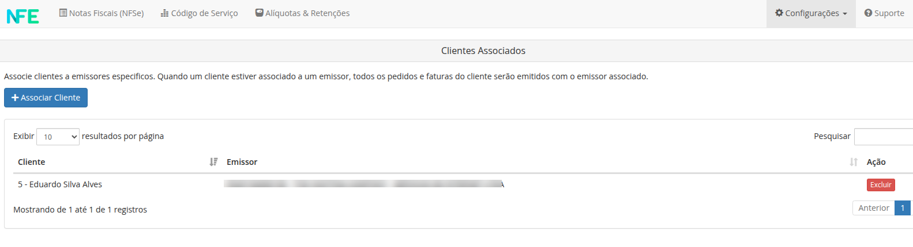
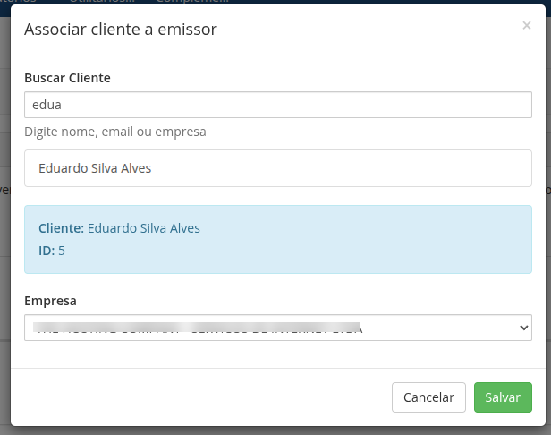
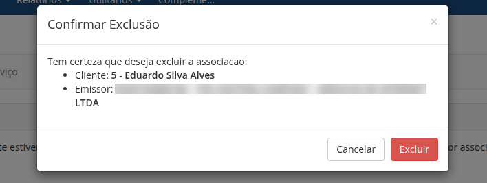

Quando múltiplos emissores estão configurados, é possível associar clientes a um emissor específico. Isso permite que um cliente utilize um emissor diferente do padrão definido na configuração global do módulo.

## Associar Clientes

Para associar um cliente a um emissor específico, acesse o menu **Configuracoes** e clique no botão **Associar Clientes**. Use o campo de pesquisa para localizar o cliente desejado, em seguida selecione o emissor desejado e clique no botão `Salvar`.

## Excluir Associação

Para excluir a associação de um cliente a um emissor específico, localize o cliente desejado na tabela e clique no botão `Excluir`. A associação será excluída e o cliente voltará a utilizar o emissor padrão definido na configuração global do módulo.

