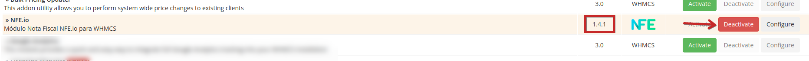

> Este documento visa auxiliar no processo de atualização do módulo da versão v1.4 para a versão v2.0

> **ATENÇÃO:** Sempre realize um backup por segurança, tanto do seu WHMCS quanto do seu banco e dados antes de realizar qualquer migração.

## Ativando as versões em paralelo

A versão 2.0 do módulo possui uma nova estrutura de diretórios, o que possibilita uma ativação em paralelo a versão anterior permitindo assim uma migração rápida e transparente. Ao ativar a nova versão em paralelo, o módulo irá buscar todas as informações da versão anterior e irá importa-las automaticamente.

Então é crucial para que o processo de atualização e migração ocorra adequadamente a **ativação em paralelo das duas versões do módulo**.

**Não desative** o módulo antigo **antes de concluir** a migração/atualização. 

## Configuração

Ao ativar a nova versão, todas as configurações globais do módulo serão automaticamente migradas. Configurações como API Key e ID da empresa já poderão ser visíveis como exemplificado na imagem a seguir.

As configurações migradas automaticamente da versão anterior são:

* API Key
* ID da Empresa
* Código de Serviço Principal
* Informações de depuragem (debug)
* RPS (legado)
* Disparar e-mail com a nota
* Quando emitir NFE
* Quando emitir NFE
* Cancelar NFE Quando Cancelar Fatura
* Informações do campo personalizado para Campo Inscrição Municipal
* Informações do campo personalizado para Campo Personalizado CPF
* Informações do campo personalizado para Campo Personalizado CNPJ
* Aplicar Impostos em todos os produtos
* Descrição da NFSe
* Exibir Link da Fatura na NFSe
* Descrição Adicional

As demais configurações migradas poderão ser verificadas acessando o módulo em `Addons -> NFE.io NFSe -> Configurações`.

## Migrando as notas fiscais

Ao ativar o novo módulo, as informações das notas fiscais emitidas a partir da versão anterior serão migradas automaticamente.

Todas as notas existentes estarão visíveis ao acessar o módulo em  `Addons -> NFE.io NFSe`.

## Migrando os códigos de serviços

Os códigos de serviços personalizados serão migrados automaticamente e poderão ser verificados acessando o módulo em `Addons -> NFE.io NFSe -> Códigos de Serviços`.

## Migrando as definições dos usuários

As configurações personalizadas de emissão de notas para os clientes também será migrada e todas as rotinas existentes de emissão para seus clientes serão mantidas.

## Verificando tudo

Por precaução, **antes de desativar a versão antiga** do módulo, faça uma verificação completa. Verifique se as configurações migradas estão corretas, verifique se as notas fiscais estão sendo listadas adequadamente e se os códigos dos serviços configurados condizem com os existentes na configuração do módulo antigo.

Fazendo esta verificação antes de seguir com a desativação e exclusão do módulo antigo ajudará a evitar problemas que não poderão ser revertidos após as próximas etapas.

## Desativando a versão anterior (1.4)

Após conferir a configurações do módulo e as notas ficais, tudo parecendo certo, você poderá desativar o módulo.

Para desativar o módulo **NFE.io v1.4.x** vá para `Configurações -> Módulos Addons` no WHMCS v7.x ou `Opções -> Módulos Addons` no WHMCS v8.x.

Localize o módulo antigo, **verifique a versão que deve ser desativada**, você deverá desativar a versão ****v1.4.x**** (sendo x qualquer versão menor como 1.4.1, 1.4.4 etc). Veja a imagem a seguir.

## Excluindo o módulo anterior (v1.4)

Após desativar o módulo **NFE.io v1.4.x**, será necessário **remover o diretório** `gofasnfeio` existente dentro de `modules/addons` como última etapa da atualização para a versão 2.0.

Para isso, utilize seu cliente FTP preferido para acessar o WHMCS, navegue até o diretório `seu_whmcs/modules/addons` para visualizar os módulos adicionais existentes em seu WHMCS e localize o diretório nomeado `gofasnfeio` como demonstrado na imagem a seguir.

Após localizar o diretório, **exclua-o**.

Pronto! Seu módulo de emissão de notas fiscais no WHMCS via NFE.io está atualizado para a versão 2.0!

### Tabelas do Banco de Dados

Este processo de atualização, por segurança, **não exclui ou manipula** as tabelas no banco de dados utilizado pela versão anterior. A versão 2.0 copia todas as informações para novas tabelas e mantém as originais intactas, e a desativação do módulo não aciona nenhuma ação de exclusão. Então **caso você tenha tido algum problema** e precise voltar o módulo para uma versão anterior a atualização, basta desativar a versão 2.0 e **reenviar os arquivos da versão originalmente em uso**.

Veja a lista a seguir das tabelas do banco de dados usadas pela versão anterior, caso você desejar fazer um backup manual ou exclui-las no futuro.

* `gofasnfeio`: todos os registros de notas fiscais já emitidas pelo módulo.
* `mod_nfeio_custom_configs`: contém todos os registros das configurações personalizadas de emissão de notas para os clientes.
* `tblproductcode`: possui todos os registros de códigos de serviços personalizados associados aos produtos/serviços.

> `tblproductcode` possui um nome muito similar as tabelas padrões do WHMCS, mas ela é uma tabela personalizada e nenhum componente ou função do nativas do WHMCS dependem dela.