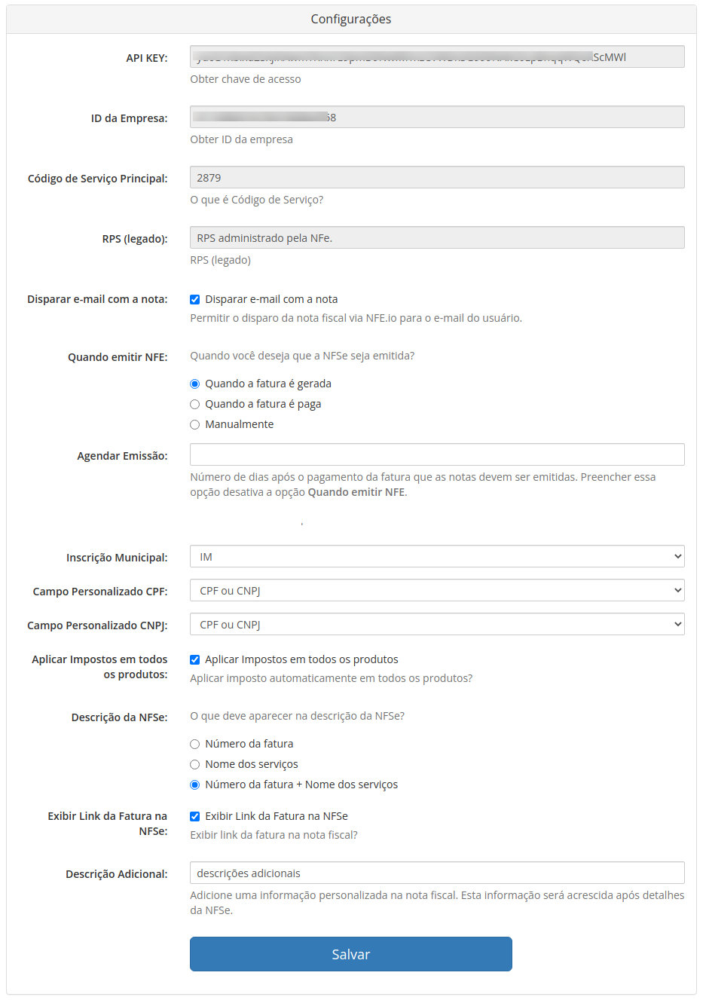

> Este documento visa auxiliar no processo de atualização do módulo da versão v1.4 para a versão v2.0

> **ATENÇÃO:** Sempre realize um backup por segurança, tanto do seu WHMCS quanto do seu banco e dados antes de realizar qualquer migração.

## Ativando as versões em paralelo

A versão 2.0 do módulo possui uma nova estrutura de diretórios, o que possibilita uma ativação em paralelo a versão anterior permitindo assim uma migração rápida e transparente. Ao ativar a nova versão em paralelo, o módulo irá buscar todas as informações da versão anterior e irá importa-las automaticamente.

Então é crucial para que o processo de atualização e migração ocorra adequadamente a **ativação em paralelo das duas versões do módulo**.

**Não desative** o módulo antigo **antes de concluir** a migração/atualização. 

## Configuração

Ao ativar a nova versão, todas as configurações globais do módulo serão automaticamente migradas. Configurações como API Key e ID da empresa já poderão ser visíveis como exemplificado na imagem a seguir.

As configurações migradas automaticamente da versão anterior são:

* API Key
* ID da Empresa
* Código de Serviço Principal
* Informações de depuragem (debug)
* RPS (legado)
* Disparar e-mail com a nota
* Quando emitir NFE
* Quando emitir NFE
* Cancelar NFE Quando Cancelar Fatura
* Informações do campo personalizado para Campo Inscrição Municipal
* Informações do campo personalizado para Campo Personalizado CPF
* Informações do campo personalizado para Campo Personalizado CNPJ
* Aplicar Impostos em todos os produtos
* Descrição da NFSe
* Exibir Link da Fatura na NFSe
* Descrição Adicional

As demais configurações migradas poderão ser verificadas acessando o módulo em `Addons -> NFE.io NFSe -> Configurações`.

## Migrando as notas fiscais

Ao ativar o novo módulo, as informações das notas fiscais emitidas a partir da versão anterior serão migradas automaticamente.

Todas as notas existentes estarão visíveis ao acessar o módulo em  `Addons -> NFE.io NFSe`

## Migrando os códigos de serviços

## Migrando as definições dos usuários

## Verificando tudo

Por precaução, **antes de desativar a versão antiga** do módulo, faça uma verificação completa. Verifique se as configurações migradas estão corretas, verifique se as notas fiscais estão sendo listadas adequadamente e se os códigos dos serviços configurados condizem com os existentes na configuração do módulo antigo.

Fazendo esta verificação antes de seguir com a desativação e exclusão do módulo antigo ajudará a evitar problemas que não poderão ser revertidos após as próximas etapas.

## Desativando a versão antiga

## Excluindo o módulo antigo