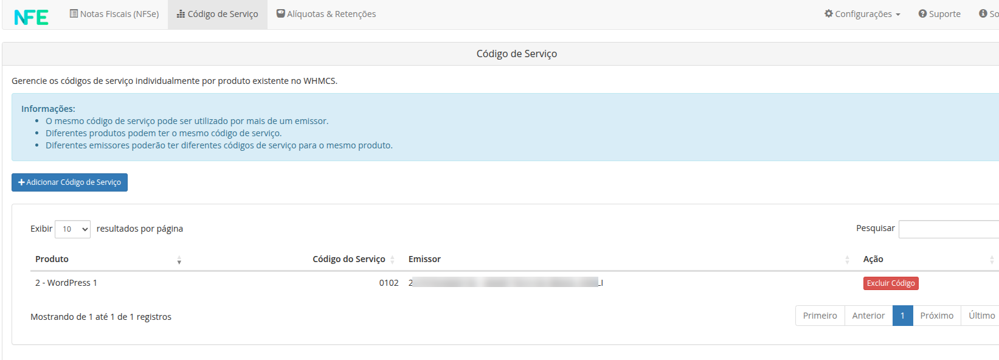
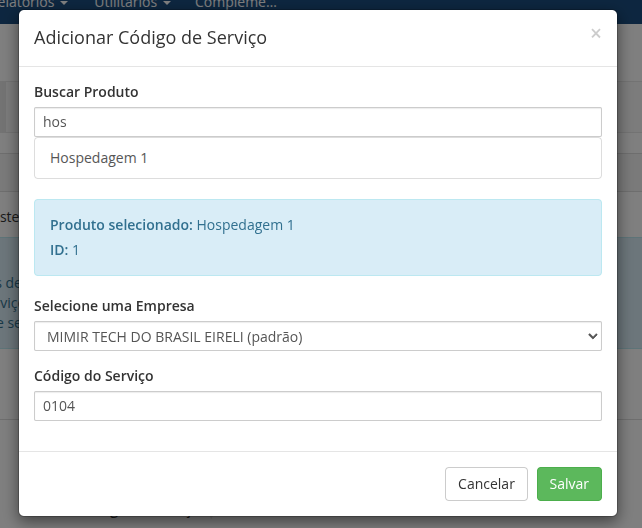
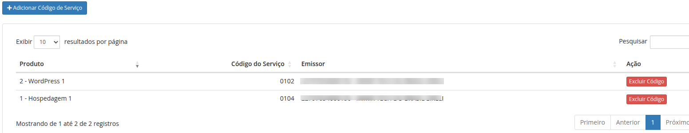

## Códigos Personalizados de Serviço

Os produtos podem ter configurações de código de serviço individuais. É possível definir os códigos de serviços personalizado por produto em `Addons -> NFE.io NFSe -> Código de Serviço`

Para definir um código de serviço personalizado, clique no botão **Adicionar Código de Serviço** e localize o produto/serviço desejado. Selecione a empresa emissora ao qual o código estará vinculado e no campo `Código do Serviço` informe o código de serviço desejado, em seguida clique no botão `Salvar Código`.

Quando multiplos emissores estão configurados, um código de serviço pode ser informado para cada empresa emissora para o mesmo produto.

### Editar Código de Serviço

Para editar um código personalizado de um produto clique no botão **Adicionar Código de Serviço** e localize o produto/serviço desejado. Em seguida informe o novo código de serviço desejado e clique no botão `Salvar Código`.

### Excluir Código de Serviço

Para excluir um código personalizado de um produto localize o produto desejado na tabela e clique no botão `Excluir Código`.

