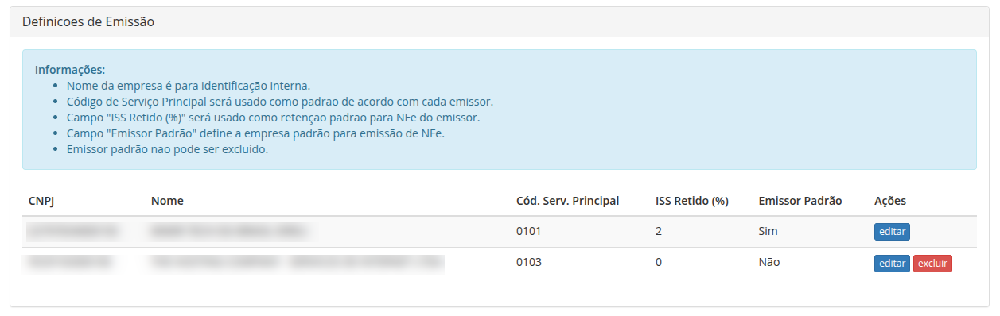
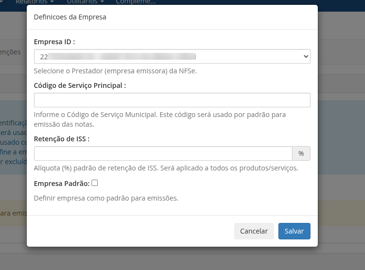

Este documento irá mostrar como configurar com sucesso o [Módulo Nota Fiscal para WHMCS via NFE.io](https://github.com/nfe/whmcs-addon). Ela irá guiar passo a passo por todo o processo de configuração.

Após a instalação e configuração inicial do addon como chave de API e código da empresa, é necessário realizar as configurações avançadas e rotinas de emissão das notas fiscais. Para isso acesse `Addons -> NFE.io NFSe -> Configurações`.


As configurações disponíveis estão descritas a seguir.

## Definicoes de Emissão

É possível configurar diferentes empresas a serem utilizados para emissão de notas fiscais pelo módulo, cada um com suas definições.



Para adicionar uma nova empresa, clique no botão `Cadastrar Emissor` e preencha os campos obrigatórios.



### Empresa

Selecione a empresa que será configurada para emissão. Será exibida uma lista com todas as empresas cadastradas na sua conta NFE.io. É possível cadastrar mais de uma empresa para emissão de notas fiscais, cada uma com suas próprias definições.

### Código de Serviço Principal

Código de serviço que será usado como padrão para geração das notas fiscais pelo WHMCS para este emissor. O código de serviço padrão será utilizado para todos os produtos/serviços que não possuírem um código de serviço personalizado definido.

### Retenção de ISS

Alíquota em porcentagem (%) padrão de retenção de ISS. Será aplicado a todos os produtos/serviços.

### Empresa Padrão

Marque esta opção para definir a empresa como padrão. A empresa padrão será utilizada para emissão de notas fiscais quando houver mais de uma empresa configurada. Caso haja apenas uma empresa configurada, a mesma será utilizada como padrão.

## Configurações Globais

As configurações globais são aplicadas a todas as empresas cadastradas no módulo. As opções disponíveis estão descritas a seguir.


### Deduzir descontos da fatura na NF

Deduzir descontos/abatimentos existentes na fatura do valor total da nota a ser emitida. Quando uma fatura possuir um item de desconto ou item com valor negativo, o mesmo será deduzido do valor total da nota a ser emitida. Se uma fatura possuir vários itens de desconto para diferentes serviços, os descontos serão somados e descontados com base no grupo de código de serviço.

> Opção habilitada por padrão.

### Quando emitir NFE

Configuração global para emissão das nots ficais pelo WHMCS, as opções disponíveis são.

1. **Quando a fatura é gerada**: A NFSe será emitida assim que uma fatura seja publicada, ou seja, esteja disponível para o cliente.
2. **Quando a fatura é paga**: A NFSe será emitida apenas quando a fatura registrar um pagamento. Esse pagamento poderá ser registrado por qualquer portal de pagamento dentro do fluxo transacional padrão do WHMCS ou manualmente ao adicionar um pagamento em uma fatura.
3. **Agendar Emissão**: Número de dias após o pagamento da fatura que as notas devem ser emitidas. Informe quantos dias após o registro do pagamento em uma fatura a NFSe será emitida.

> **Atenção:** agendar emissão de notas desativa a configuração **Quando emitir NFE**.

### Cancelar NFE Quando Cancelar Fatura

Marque esta opção para cancelar automaticamente uma nota quando a fatura associada é cancelada.

### Inscrição Municipal

Selecione o campo personalizado criado anteriormente que será responsável por registrar o número de inscrição municipal do cliente.

### Campo Personalizado CPF

Selecione o campo personalizado criado anteriormente que será responsável pelo CPF do cliente. Este campo poderá ser o mesmo para CPF e CNPJ.

### Campo Personalizado CNPJ

Selecione o campo personalizado criado anteriormente que será responsável pelo CNPJ do cliente. Selecione o mesmo campo personalizado do CPF caso seja um campo único para ambos os números de documento (CPF/CNPJ).

### Descrição da NFSe

Selecione a informação que será exibida no campo de descrição da nota fiscal.

1. **Número da fatura**: Exibe apenas o número da fatura vinculada a NFSe.
2. **Nome dos serviços**: Exibe o nome de todos os serviços vinculados a fatura.
3. **Número da fatura + Nome dos Serviços**: Exibe o número da fatura em uma linha e o nome de todos os serviços vinculados a fatura em outra linha.

### Link da Fatura na NFSe

Inclui o link da fatura juntamente com a descrição da NFSe na mensagem da nota.

### Enviar e-mail

Habilita a opção de envio da nota fiscal por e-mail ao cliente.

> O e-mail será enviado para o endereço principal cadastrado no perfil do cliente e a mensagem será disparada pela plataforma da NFE.io.

### Descrição Adicional

Campo livre para informação adicional que será exibida no campo mensagem da nota fiscal.


## Emissão Personalizada por cliente

É possível definir uma **opção de emissão personalizada por cliente**, esta opção de emissão sobrescreve a configuração global de emissão configurada.

Para inserir uma opção personalizada de emissão, acesse o perfil do cliente desejado e localize o campo `Emitir nota fiscal quando` e selecione uma das opções de emissão da lista, como exemplificado na imagem a seguir.


## Link da nota na fatura

Para inserir um link da nota fiscal do PDF e XML, edite o arquivo `viewinvoice.tpl` da pasta do template do WHMCS, utilize o exemplo abaixo:

```smarty
{include file="../../modules/addons/NFEioServiceInvoices/lib/templates/clientarea/viewinvoice.tpl"}
```

Recomendamos a inserção da tabela logo acima da linha:
```smarty
<p class="text-center d-print-none"><a href="clientarea.php?action=invoices">{lang key='invoicesbacktoclientarea'}</a></p>
```

Exemplo de exibição do downwload da NF na visualização da fatura pelo cliente.


