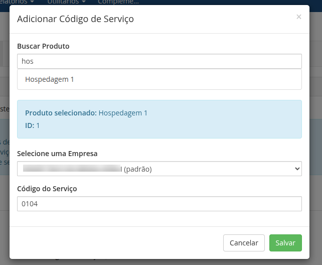

Este documento irá mostrar como configurar com sucesso o [Módulo Nota Fiscal para WHMCS via NFE.io](https://github.com/nfe/whmcs-addon). Ela irá guiar passo a passo por todo o processo de configuração.

## Configurações do Módulo

Após a instalação e configuração inicial do addon como chave de API e código da empresa, é necessário realizar as configurações avançadas e rotinas de emissão das notas fiscais. Para isso acesse `Addons -> NFE.io NFSe -> Configurações`.


As configurações disponíveis estão descritas a seguir.

### API Key

Chave de acesso privada gerado na sua conta NFE.io, necessária para a autenticação das chamadas à API.

> Configurado na etapa de instalação do módulo.

### ID da Empresa

ID da empresa ao qual serão associadas as notas fiscais gerados pelo WHMCS.

> Configurado na etapa de instalação do módulo.

### Código de Serviço Principal

Código de serviço que será usado como padrão para geração das notas fiscais pelo WHMCS.

> Configurado na etapa de instalação do módulo.

### RPS

Campo legado RPS.

### Disparar e-mail com a nota

Habilita a opção de envio da nota fiscal por e-mail ao cliente.

> O e-mail será enviado para o endereço principal cadastrado no perfil do cliente diretamente pela NFE.io.

### Quando emitir NFE

Configuração global para emissão das nots ficais pelo WHMCS, as opções disponíveis são.

#### Quando a fatura é gerada

A NFSe será emitida assim que uma fatura seja publicada, ou seja, esteja disponível para o cliente.

#### Quando a fatura é paga

A NFSe será emitida apenas quando a fatura registrar um pagamento. Esse pagamento poderá ser registrado por qualquer portal de pagamento dentro do fluxo transacional padrão do WHMCS ou manualmente ao adicionar um pagamento em uma fatura.

### Agendar Emissão

Número de dias após o pagamento da fatura que as notas devem ser emitidas. Informe quantos dias após o registro do pagamento em uma fatura a NFSe será emitida.

**Atenção:** agendar emissão de notas desativa a configuração **Quando emitir NFE**.

### Cancelar NFE Quando Cancelar Fatura

Marque esta opção para cancelar automaticamente uma nota quando a fatura associada é cancelada.

### Inscrição Municipal

Selecione o campo personalizado criado anteriormente que será responsável por registrar o número de inscrição municipal do cliente.

### Campo Personalizado CPF

Selecione o campo personalizado criado anteriormente que será responsável pelo CPF do cliente. Este campo poderá ser o mesmo para CPF e CNPJ.

### Campo Personalizado CNPJ

Selecione o campo personalizado criado anteriormente que será responsável pelo CNPJ do cliente. Selecione o mesmo campo personalizado do CPF caso seja um campo único para ambos os números de documento (CPF/CNPJ).

### Aplicar Impostos em todos os produtos

Esta opção define que todos os serviços terão impostos aplicados, caso contrário a aplicação de imposto é selecionada de forma individual por serviço.

### Descrição da NFSe

Selecione a informação que será exibida no campo de descrição da nota fiscal.

#### Número da fatura

Exibe apenas o número da fatura vinculada a NFSe.

#### Nome dos serviços

Exibe o nome de todos os serviços vinculados a fatura.

#### Número da fatura + Nome dos Serviços

Exibe o número da fatura em uma linha e o nome de todos os serviços vinculados a fatura em outra linha.

### Exibir Link da Fatura na NFSe

Exibe o link da fatura juntamente com a descrição da NFSe na mensagem da nota.

### Descrição Adicional

Campo livre para informação adicional que será exibida no campo mensagem da nota fiscal.

## Configurações dos Produtos/Serviços

Os produtos podem ter configurações de código de serviço individuais. É possível definir os códigos de serviços personalizado por produto em `Addons -> NFE.io NFSe -> Código de Serviço`


Para definir um código de serviço personalizado, localize o produto/serviço desejado e no campo `Código do Serviço` informe o código de serviço desejado, em seguida clique no botão `Salvar Código`.



> **Dica:** para alterar um código basta alterar o desejado e clicar no botão `Salvar Código` referente.

Para excluir um código personalizado de um produto, e voltar a utilizar a configuração global, localize o produto desejado e clique no botão `Excluir Código`.


> **Dica:** use o campo `Pesquisar` localizado no canto superior da tabela para pesquisar os produtos desejados pelo nome ou ID.

## Emissão Personalizada por cliente

É possível definir uma **opção de emissão personalizada por cliente**, esta opção de emissão sobrescreve a configuração global de emissão configurada.

Para inserir uma opção personalizada de emissão, acesse o perfil do cliente desejado e localize o campo `Emitir nota fiscal quando` e selecione uma das opções de emissão da lista, como exemplificado na imagem a seguir.


## Link da nota na fatura

Para inserir um link da nota fiscal do PDF e XML, edite o arquivo `viewinvoice.tpl` da pasta do template do WHMCS, utilize o exemplo abaixo:

```xhtml
{if $status eq "Paid" || $clientsdetails.userid eq "6429"}<i class="fal fa-file-invoice" aria-hidden="true"></i> NOTA FISCAL  <a href="/modules/addons/gofasnfeio/pdf.php?invoice_id={$invoiceid}" target="_blank" class="btn btn-link" tite="Nota Fiscal disponível 24 horas após confirmação de pagamento.">PDF</a> | <a href="/modules/addons/gofasnfeio/xml.php?invoice_id={$invoiceid}" target="_blank" class="btn btn-link" tite="Nota Fiscal disponível 24 horas após confirmação de pagamento.">XML</a>{/if}

```