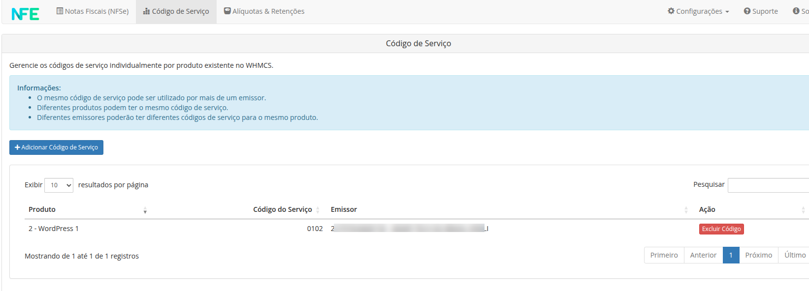

Este documento irá mostrar como configurar com sucesso o [Módulo Nota Fiscal para WHMCS via NFE.io](https://github.com/nfe/whmcs-addon). Ela irá guiar passo a passo por todo o processo de configuração.

## Configurações do Módulo

wip

## Configurações dos Produtos/Serviços

Os produtos podem ter configurações de código de serviço individuais. É possível definir os códigos de serviços personalizado por produto em `Addons -> NFE.io NFSe -> Código de Serviço`



Para definir um código de serviço personalizado, localize o produto/serviço desejado e no campo `Código do Serviço` informe o código de serviço desejado, em seguida clique no botão `Salvar Código`.


> **Dica:** para alterar um código basta alterar o desejado e clicar no botão `Salvar Código` referente.

Para excluir um código personalizado de um produto, e voltar a utilizar a configuração global, localize o produto desejado e clique no botão `Excluir Código`.


> **Dica:** use o campo `Pesquisar` localizado no canto superior da tabela para pesquisar os produtos desejados pelo nome ou ID.

## Emissão Personalizada por cliente

É possível definir uma **opção de emissão personalizada por cliente**, esta opção de emissão sobrescreve a configuração global de emissão configurada.

Para inserir uma opção personalizada de emissão, acesse o perfil do cliente desejado e localize o campo `Emitir nota fiscal quando` e selecione uma das opções de emissão da lista, como exemplificado na imagem a seguir.


## Link da nota na fatura

Para inserir um link da nota fiscal do PDF e XML, edite o arquivo `viewinvoice.tpl` da pasta do template do WHMCS, utilize o exemplo abaixo:

```xhtml
{if $status eq "Paid" || $clientsdetails.userid eq "6429"}<i class="fal fa-file-invoice" aria-hidden="true"></i> NOTA FISCAL  <a href="/modules/addons/gofasnfeio/pdf.php?invoice_id={$invoiceid}" target="_blank" class="btn btn-link" tite="Nota Fiscal disponível 24 horas após confirmação de pagamento.">PDF</a> | <a href="/modules/addons/gofasnfeio/xml.php?invoice_id={$invoiceid}" target="_blank" class="btn btn-link" tite="Nota Fiscal disponível 24 horas após confirmação de pagamento.">XML</a>{/if}

```