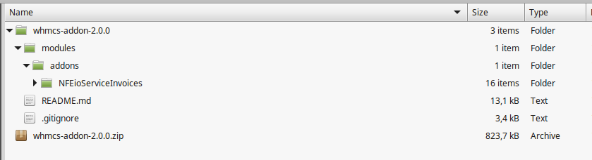
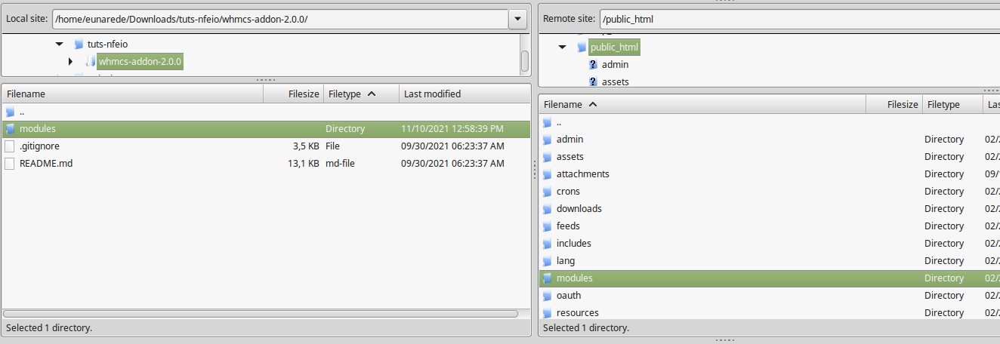
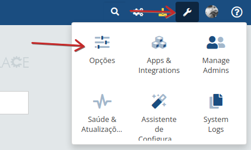
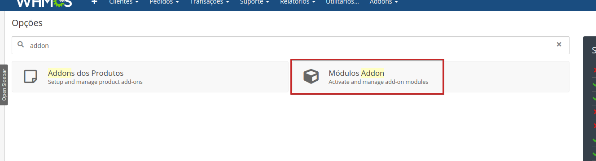
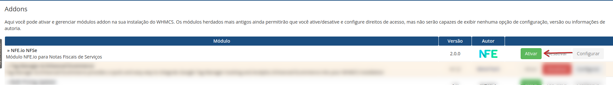
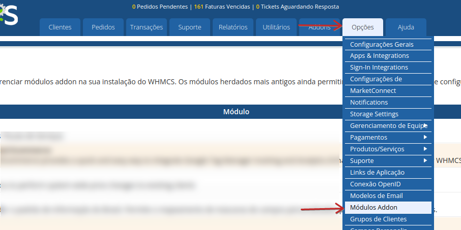
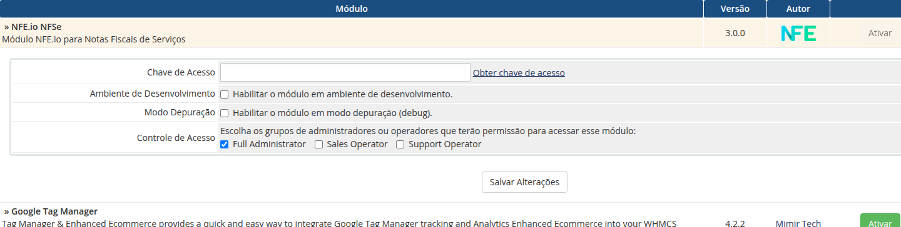

Este documento irá mostrar como instalar com sucesso o [Módulo Nota Fiscal para WHMCS via NFE.io](https://github.com/nfe/whmcs-addon). Ela irá guiar passo a passo por todo o processo de instalação.

## Antes de começar

Antes de realizar a instalação do módulo, leia com atenção as informações a seguir, elas são importantes para que todo o processo de instalação possa ocorrer sem problemas.

### Requisitos

Os requisitos a seguir são necessários para o funcionamento adequado do módulo e integração.

1. WHMCS versão 7.2 ou superior;
2. PHP 5.6 ou superior;
3. Chave de API da NFE.io;
4. Automação do WHMCS devidamente configurada ([https://docs.whmcs.com/Automation_Settings](https://docs.whmcs.com/Automation_Settings));
5. Tarefas cron do Sistema sendo executadas conforme recomendações do WHMCS [https://docs.whmcs.com/Crons#System_Cron](https://docs.whmcs.com/Crons#System_Cron).

### Campos Personalizados

O módulo irá requerer os seguintes campos personalizados para o cliente:

1. CPF/CNPJ (obrigatório)
2. Inscrição Municipal (opcional)

Na administração do WHMCS, crie um campo personalizado de cliente para registrar o CPF/CNPJ necessário para a emissão da NFSe e outro para a Inscrição Municipal.

**Caso já exista** um campo personalizado de cliente configurado e utilizado para registrar o número do documento (CPF/CNPJ), **não será necessário criar outro**. 

O campo `Inscrição Estadual` é opcional, mas recomendado para emissão de notas para pessoa jurídica.

> **Atenção:** O módulo identificará automaticamente se o número de documento informado no campo personalizado se trata de CPF ou CNPJ e emitirá a nota em conformidade com o tipo de pessoa (física ou jurídica).

> **Dica:** se desejar, é possível utilizar campos personalizados distintos para CPF e CNPJ. 

## Instalação

Para instalar o módulo no WHMCS realize os seguintes passos.

### Baixar o módulo

Faça o download arquivo zip da última versão módulo neste link [https://github.com/nfe/whmcs-addon/releases/latest](https://github.com/nfe/whmcs-addon/releases/latest)

### Descompactar o zip

Descompacte o zip baixado, o conteúdo do diretório extraído deve ser semelhante a este:

* modules
  * addons
    * NFEioServiceInvoices

### Enviar arquivos para o WHMCS

Carregue o diretório `modules` existente no arquivo descompactado para o diretório de instalação do seu WHMCS.

Por exemplo, tendo o WHMCS instalado em `public_html`, carregue o diretório `modules` em `public_html`.

> **Dica:** O arquivo descompactado já está na estrutura associada aos módulos addon do WHMCS `modules/addons`. Ao carregar o diretório `modules` você automaticamente carregará o diretório do módulo `modules/addons/NFEioServiceInvoices`.

### Ativar o módulo addon

Após realizar o carregamento dos arquivos do módulo, ele está disponível para ativação e configuração no WHMCS.

Veja a seguir os passos para ativação do módulo no WHMCS 8 e WHMCS 7.

#### WHMCS 8.X

Para ativar o módulo adicional no WHMCS versão 8.x vá até o ícone de chave no canto superior direito e clique em `Opções`.

O campo de busca em `Opções` digite `addon` e acesse a opção `Módulos Addon`.

Localize o módulo addon **NFE.io NFSe** e clique no botão `Ativar`.

#### WHMCS 7.X

Para ativar o módulo adicional no WHMCS versão 7.x acesse o menu `Opções -> Módulos Addons`.

Localize o módulo addon **NFE.io NFSe** e clique no botão `Ativar`.

## Configuração do addon

Após ativar o [Módulo Nota Fiscal para WHMCS via NFE.io](https://github.com/nfe/whmcs-addon) as seguintes opções devem ser configuradas.

#### API Key

> campo obrigatório

Chave de acesso privada gerado na sua conta NFE.io, necessária para a autenticação das chamadas à API.

Obtenha uma chave de acesso a API neste link [https://app.nfe.io/account/apikeys](https://app.nfe.io/account/apikeys)

#### ID da Empresa

> campo obrigatório

Informe o ID da empresa ao qual serão associadas as notas fiscais gerados pelo WHMCS.

Obtenha o ID da empresa neste link [https://app.nfe.io/companies/](https://app.nfe.io/account/apikeys)

#### Código do Serviço Principal

> campo obrigatório

Código de serviço que será usado como padrão para geração das notas fiscais pelo WHMCS. Este código irá variar de acordo com a categoria de tributação do negócio no município. 

Saiba mais sobre o código de serviço neste link [https://nfe.io/docs/nota-fiscal-servico/conceitos-nfs-e/#o-que-e-codigo-de-servico](https://app.nfe.io/account/apikeys)

#### Ambiente de desenvolvimento

Emite as notas em modo "depuragem" sem valor real no lado da NFE.io, **ative apenas em caso de necessidade ou homologação**.

#### Debug

Marque essa opção para salvar informações de diagnóstico no Log de Módulo do WHMCS, **ative apenas em caso de necessidade**.

#### Controle de Acesso

Escolha os grupos de administradores ou  operadores que terão para acessar o módulo.

> **dics:** informe todos os grupos de operadores que precisem acessar e operar o módulo. 

Após realizar a instalação e configuração inicial, siga para as configurações detalhadas do módulo em https://nfe.github.io/whmcs-addon/docs/configuracao