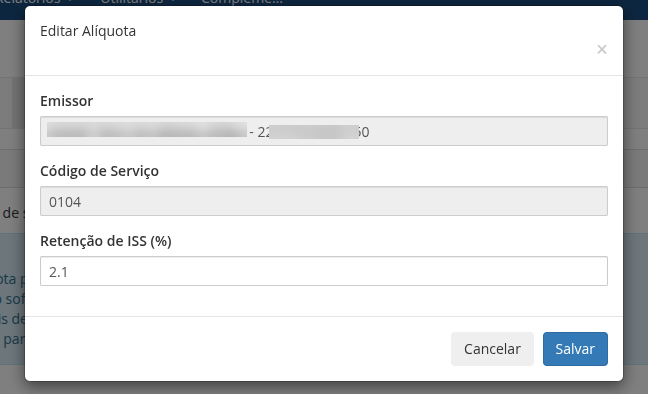

O módulo permite o cadastro de alíquotas de retenção de ISS personalizadas para os diferentes códigos de serviços cadastrados no WHMCS.
As alíquotas de retenção de ISS são aplicadas apenas para os produtos/serviços que possuírem um código de serviço personalizado definido. Caso não exista um código de serviço personalizado definido, será utilizada a alíquota padrão definida na configuração global do módulo.

## Adicionar Retenções

No menu **Alíquotas & Retenções** é possível definir alíquotas de retenção de ISS personalizadas para os diferentes códigos de serviços personalizados cadastrados no WHMCS.

Caso existam códigos de serviços personalizados cadastrados, você poderá informar alíquotas diferentes para cada um, independente do valor definido na configuração global do módulo.

Códigos de serviço com **alíquota com valor 0 (zero)** não sofrerão cálculo de retenção de ISS.

## Editar Retenções

Para editar uma alíquota de retenção, localize o código de serviço desejado na tabela e clique no botão `Editar`. Em seguida informe a nova alíquota desejada e clique no botão `Salvar`.

## Excluir Retenções

Para excluir uma alíquota de retenção, localize o código de serviço desejado na tabela e clique no botão `Remover`.

